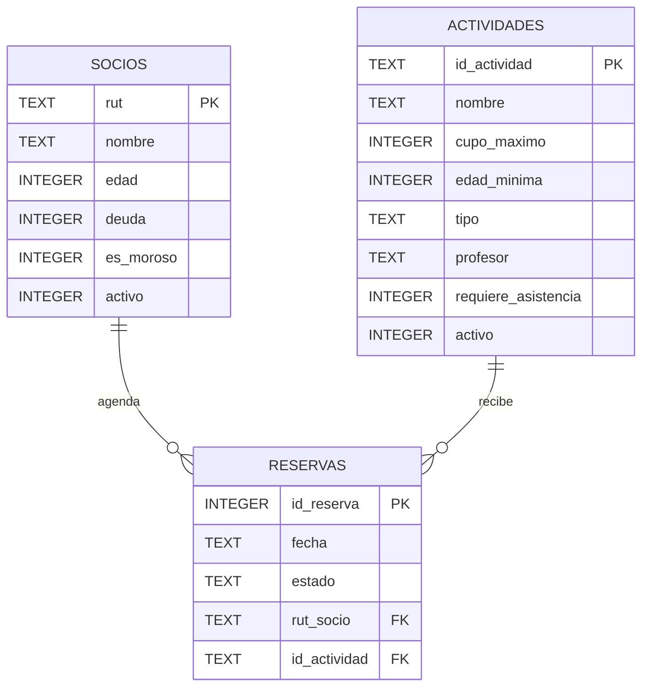

```mermaid
erDiagram
    SOCIOS {
        TEXT rut PK
        TEXT nombre
        INTEGER edad
        INTEGER deuda
        INTEGER es_moroso
        INTEGER activo
    }

    ACTIVIDADES {
        TEXT id_actividad PK
        TEXT nombre
        INTEGER cupo_maximo
        INTEGER edad_minima
        TEXT tipo
        TEXT profesor
        INTEGER requiere_asistencia
        INTEGER activo
    }

    RESERVAS {
        INTEGER id_reserva PK
        TEXT fecha
        TEXT estado
        TEXT rut_socio FK
        TEXT id_actividad FK
    }

    SOCIOS ||--o{ RESERVAS : "agenda"
    ACTIVIDADES ||--o{ RESERVAS : "recibe"
```
