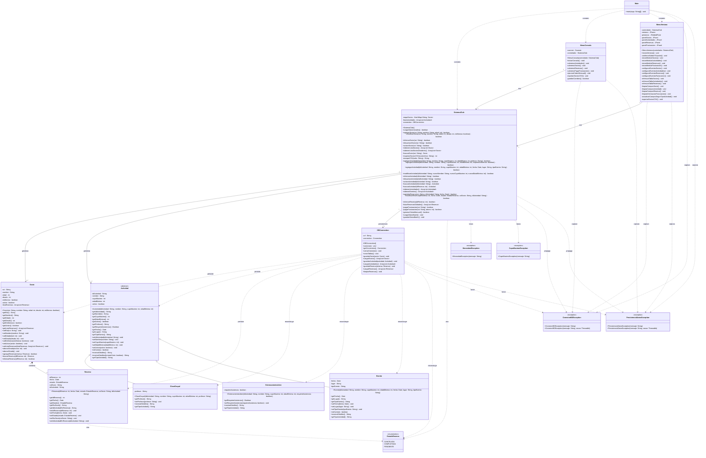

# Diagrama de Clases UML

```mermaid
classDiagram

    %% =====================================================
    %% MAIN
    %% =====================================================

    class Main {
        +main(args: String[]) void
    }


    %% =====================================================
    %% VISTAS
    %% =====================================================

    class MenuConsola {
        -scanner : Scanner
        -controlador : SistemaClub

        +MenuConsola(controlador: SistemaClub)
        +iniciarConsola() void

        -submenuActividades() void
        -submenuSocios() void
        -submenuReservas() void
        -submenuPagarFacturacion() void

        -ejecutarCobroMensual() void
        -exportarSociosCSV() void
        -guardarCambios() boolean
    }


    class MenuVentana {
        -controlador : SistemaClub
        -ventana : JFrame
        -pestanas : JTabbedPane

        -panelSocios : JPanel
        -panelActividades : JPanel
        -panelReservas : JPanel
        -panelFacturacion : JPanel

        +MenuVentana(controlador: SistemaClub)
        +iniciarVentana() void

        -confirmarSalidaYGuardar() void

        -iniciarModuloSocios() void
        -iniciarModuloActividades() void
        -iniciarModuloReservas() void
        -iniciarModuloFacturacion() void

        -configurarEventosSocios() void
        -configurarEventosActividades() void
        -configurarEventosReservas() void
        -configurarEventosFacturacion() void

        -refrescarTablaSocios() void
        -refrescarTablaActividades() void
        -refrescarTablaReservas() void

        -limpiarCamposSocio() void
        -limpiarCamposActividad() void
        -limpiarCamposReserva() void
        -limpiarInformacionFacturacion() void

        -actualizarCamposSegunTipoActividad() void
        -exportarSociosCSV() void
    }


    %% =====================================================
    %% CONTROLADOR
    %% =====================================================

    class SistemaClub {
        -mapaSocios : HashMap~String, Socio~
        -listaActividades : ArrayList~Actividad~
        -connection : DBConnection

        +SistemaClub()

        +cargarDatosIniciales() boolean

        %% Socios
        +agregarSocio(rut: String, nombre: String, edad: int) boolean
        +modificarSocio(rut: String, nombre: String, edad: int, deuda: int, esMoroso: boolean) boolean
        +eliminarSocio(rut: String) boolean
        +desactivarSocio(rut: String) boolean
        +activarSocio(rut: String) boolean
        +obtenerListaSocios() ArrayList~Socio~
        +obtenerListaSociosDeudores() ArrayList~Socio~
        +buscarSocio(rut: String) Socio

        %% Exportacion
        +exportarSociosCSV(rutaArchivo: String) int
        -escaparCSV(valor: String) String

        %% Actividades
        +agregarActividad(idActividad: String, nombre: String, cupoMaximo: int, edadMinima: int, profesor: String) boolean
        +agregarActividad(idActividad: String, nombre: String, cupoMaximo: int, edadMinima: int, requiereAsistencia: boolean) boolean
        +agregarActividad(idActividad: String, nombre: String, cupoMaximo: int, edadMinima: int, fecha: Date, lugar: String, tipoEvento: String) boolean

        +modificarActividad(idActividad: String, nuevoNombre: String, nuevoCupoMaximo: int, nuevaEdadMinima: int) boolean
        +eliminarActividad(idActividad: String) boolean
        +desactivarActividad(idActividad: String) boolean
        +activarActividad(idActividad: String) boolean

        +buscarActividad(idActividad: String) Actividad
        +buscarActividad(idReserva: int) Actividad

        +obtenerActividades() ArrayList~Actividad~
        +obtenerEventos() ArrayList~Actividad~

        %% Reservas
        +agendarReserva(rut: String, idActividad: String, fecha: Date) boolean
        +modificarReserva(idReserva: int, fecha: Date, estado: EstadoReserva, rutSocio: String, idActividad: String) boolean
        +eliminarReserva(idReserva: int) boolean
        +listarReservasGlobales() ArrayList~Reserva~

        %% Facturacion
        +pagarFacturacion(rut: String) boolean
        +pagarFacturacion(rut: String, abono: int) boolean
        +generarCobroMensual() boolean

        %% Persistencia
        +cargarDatosBatch() void
        +guardarDatosBatch() void
    }


    %% =====================================================
    %% PERSISTENCIA
    %% =====================================================

    class DBConnection {
        -url : String
        -connection : Connection

        +DBConnection()

        +conectar() void
        +getConnection() Connection
        +cerrarConexion() void

        +crearTablas() void

        +guardarSocio(socio: Socio) void
        +cargarSocios() ArrayList~Socio~

        +guardarActividad(actividad: Actividad) void
        +cargarActividades() ArrayList~Actividad~

        +guardarReserva(reserva: Reserva) void
        +cargarReservas() ArrayList~Reserva~

        +limpiarReservas() void
    }


    %% =====================================================
    %% MODELO
    %% =====================================================

    class Actividad {
        <<abstract>>

        -idActividad : String
        -nombre : String
        -cupoMaximo : int
        -edadMinima : int
        -activo : boolean

        +Actividad(idActividad: String, nombre: String, cupoMaximo: int, edadMinima: int)

        +getIdActividad() String
        +getNombre() String
        +getCupoMaximo() int
        +getEdadMinima() int
        +getActivo() boolean

        +getProfesor() String
        +getRequiereAsistencia() Boolean
        +getFecha() Date
        +getLugar() String
        +getTipoEvento() String

        +setIdActividad(idActividad: String) void
        +setNombre(nombre: String) void
        +setCupoMaximo(cupoMaximo: int) void
        +setEdadMinima(edadMinima: int) void
        +setActivo(activo: boolean) void

        +esEvento() boolean

        +mostrarDetalles() String
        +mostrarDetalles(formatoCorto: boolean) String

        +getTipoActividad() String
    }


    class ClaseGrupal {
        -profesor : String

        +ClaseGrupal(idActividad: String, nombre: String, cupoMaximo: int, edadMinima: int, profesor: String)

        +getProfesor() String
        +setProfesor(profesor: String) void

        +mostrarDetalles() String
        +getTipoActividad() String
    }


    class EntrenamientoLibre {
        -requiereAsistencia : boolean

        +EntrenamientoLibre(idActividad: String, nombre: String, cupoMaximo: int, edadMinima: int, requiereAsistencia: boolean)

        +getRequiereAsistencia() Boolean
        +setRequiereAsistencia(requiereAsistencia: boolean) void

        +mostrarDetalles() String
        +getTipoActividad() String
    }


    class Evento {
        -fecha : Date
        -lugar : String
        -tipoEvento : String

        +Evento(idActividad: String, nombre: String, cupoMaximo: int, edadMinima: int, fecha: Date, lugar: String, tipoEvento: String)

        +getFecha() Date
        +getLugar() String
        +getTipoEvento() String

        +setFecha(fecha: Date) void
        +setLugar(lugar: String) void
        +setTipoEvento(tipoEvento: String) void

        +esEvento() boolean
        +mostrarDetalles() String
        +getTipoActividad() String
    }


    class Socio {
        -rut : String
        -nombre : String
        -edad : int
        -deuda : int
        -esMoroso : boolean
        -activo : boolean
        -listaReservas : ArrayList~Reserva~

        +Socio(rut: String, nombre: String, edad: int, deuda: int, esMoroso: boolean)

        +getRut() String
        +getNombre() String
        +getEdad() int
        +getDeuda() int
        +getEsMoroso() boolean
        +getActivo() boolean
        +getListaReservas() ArrayList~Reserva~

        +setRut(rut: String) void
        +setNombre(nombre: String) void
        +setEdad(edad: int) void
        +setDeuda(deuda: int) void
        +setEsMoroso(esMoroso: boolean) void
        +setActivo(activo: boolean) void
        +setListaReservas(listaReservas: ArrayList~Reserva~) void

        +abonarDeuda(monto: int) void
        +abonarDeuda() void

        +agregarReserva(reserva: Reserva) boolean
        +buscarReserva(idReserva: int) Reserva
        +eliminarReserva(idReserva: int) boolean
    }


    class Reserva {
        -idReserva : int
        -fecha : Date
        -estado : EstadoReserva
        -rutSocio : String
        -idActividad : String

        +Reserva(idReserva: int, fecha: Date, estado: EstadoReserva, rutSocio: String, idActividad: String)

        +getIdReserva() int
        +getFecha() Date
        +getEstado() EstadoReserva
        +getRutSocio() String
        +getIdActividadEnReserva() String

        +setIdReserva(idReserva: int) void
        +setFecha(fecha: Date) void
        +setEstado(estado: EstadoReserva) void
        +setRutSocio(rutSocio: String) void
        +setIdActividadEnReserva(idActividad: String) void
    }


    class EstadoReserva {
        <<enumeration>>

        CANCELADA
        COMPLETADA
        PENDIENTE
    }


    %% =====================================================
    %% EXCEPCIONES
    %% =====================================================

    class MorosidadException {
        <<exception>>

        +MorosidadException(mensaje: String)
    }


    class CupoMaximoException {
        <<exception>>

        +CupoMaximoException(mensaje: String)
    }


    class ConexionBDException {
        <<exception>>

        +ConexionBDException(mensaje: String)
        +ConexionBDException(mensaje: String, causa: Throwable)
    }


    class PersistenciaDatosException {
        <<exception>>

        +PersistenciaDatosException(mensaje: String)
        +PersistenciaDatosException(mensaje: String, causa: Throwable)
    }


    %% =====================================================
    %% GENERALIZACION / HERENCIA
    %% =====================================================

    Actividad <|-- ClaseGrupal
    Actividad <|-- EntrenamientoLibre
    Actividad <|-- Evento


    %% =====================================================
    %% RELACIONES ESTRUCTURALES
    %% =====================================================

    Socio "1" *-- "0..*" Reserva : contiene

    SistemaClub "1" --> "0..*" Socio : gestiona
    SistemaClub "1" --> "0..*" Actividad : gestiona
    SistemaClub "1" --> "1" DBConnection : persistencia


    %% =====================================================
    %% DEPENDENCIAS DEL MODELO
    %% =====================================================

    Reserva ..> EstadoReserva : usa
    SistemaClub ..> EstadoReserva : usa


    %% =====================================================
    %% DEPENDENCIAS DE PERSISTENCIA
    %% =====================================================

    DBConnection ..> Socio : persiste
    DBConnection ..> Actividad : persiste
    DBConnection ..> Reserva : persiste

    DBConnection ..> ClaseGrupal : reconstruye
    DBConnection ..> EntrenamientoLibre : reconstruye
    DBConnection ..> Evento : reconstruye
    DBConnection ..> EstadoReserva : reconstruye


    %% =====================================================
    %% VISTA / CONTROLADOR
    %% =====================================================

    MenuConsola "1" --> "1" SistemaClub : usa
    MenuVentana "1" --> "1" SistemaClub : usa


    %% =====================================================
    %% RELACIONES DE CREACION
    %% =====================================================

    Main ..> SistemaClub : «create»
    Main ..> MenuConsola : «create»
    Main ..> MenuVentana : «create»


    %% =====================================================
    %% EXCEPCIONES UTILIZADAS
    %% =====================================================

    SistemaClub ..> MorosidadException : lanza
    SistemaClub ..> CupoMaximoException : lanza
    SistemaClub ..> ConexionBDException : propaga
    SistemaClub ..> PersistenciaDatosException : propaga

    DBConnection ..> ConexionBDException : lanza
    DBConnection ..> PersistenciaDatosException : lanza

    Main ..> ConexionBDException : captura
    Main ..> PersistenciaDatosException : captura

    MenuConsola ..> ConexionBDException : captura
    MenuConsola ..> PersistenciaDatosException : captura

    MenuVentana ..> ConexionBDException : captura
    MenuVentana ..> PersistenciaDatosException : captura
```