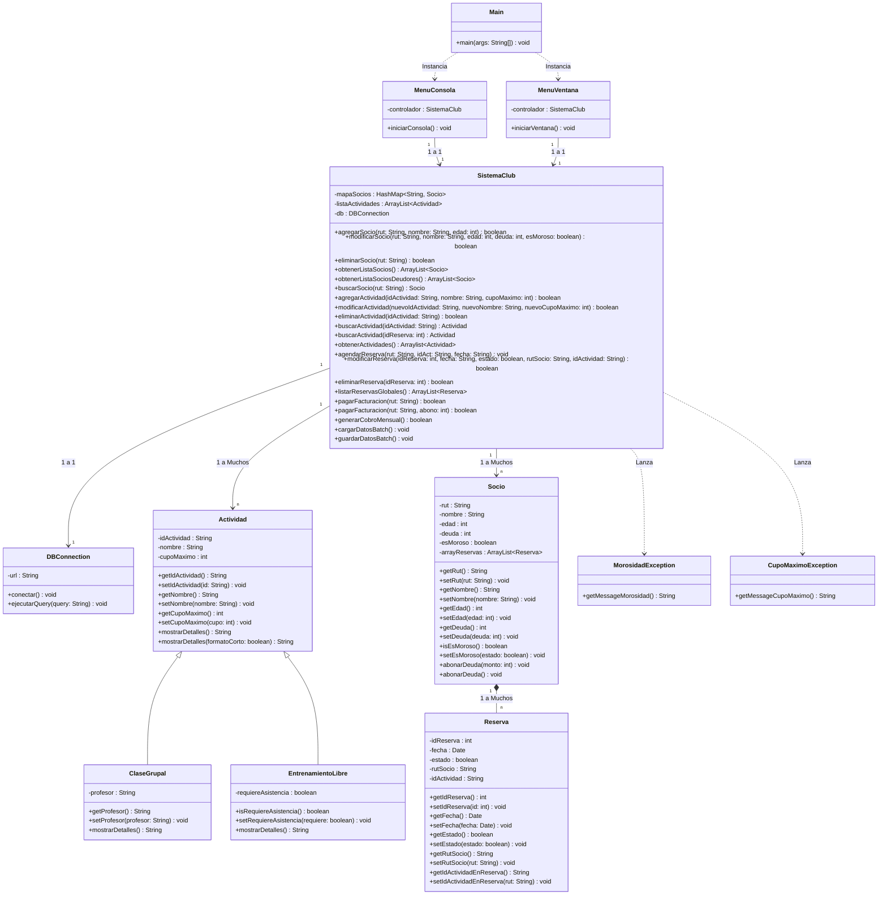

```mermaid
classDiagram
    %% ==========================================
    %% CAPA VISTA Y CONTROLADOR (Resumida para enfoque en Modelo)
    %% ==========================================
    class Main {
        +main(args: String[]) void
    }
    
    class MenuConsola {
        -controlador : SistemaClub
        +iniciarConsola() void
    }
    
    class MenuVentana {
        -controlador : SistemaClub
        +iniciarVentana() void
    }

    class SistemaClub {
        -mapaSocios : HashMap~String, Socio~
        -listaActividades : ArrayList~Actividad~
        -db : DBConnection
        +agregarSocio(rut: String, nombre: String, edad: int) boolean
	   +modificarSocio(rut: String, nombre: String, edad: int, deuda: int, esMoroso: boolean) boolean
	   +eliminarSocio(rut: String) boolean
	   +obtenerListaSocios() ArrayList~Socio~
	   +obtenerListaSociosDeudores() ArrayList~Socio~
	   +buscarSocio(rut: String) Socio
        +agregarActividad(idActividad: String, nombre: String, cupoMaximo: int) boolean
        +modificarActividad(nuevoIdActividad: String, nuevoNombre: String, nuevoCupoMaximo: int) boolean
        +eliminarActividad(idActividad: String) boolean
        +buscarActividad(idActividad: String) Actividad
        +buscarActividad(idReserva: int) Actividad
        +obtenerActividades() Arraylist~Actividad~
        +agendarReserva(rut: String, idAct: String, fecha: String) void
        +modificarReserva(idReserva: int, fecha: String, estado: boolean, rutSocio: String, idActividad: String) boolean
        +eliminarReserva(idReserva: int) boolean
        +listarReservasGlobales() ArrayList~Reserva~
        +pagarFacturacion(rut: String) boolean
        +pagarFacturacion(rut: String, abono: int) boolean
        +generarCobroMensual() boolean   
        +cargarDatosBatch() void
        +guardarDatosBatch() void
    }
    
    class DBConnection {
        -url : String
        +conectar() void
        +ejecutarQuery(query: String) void
    }

    %% ==========================================
    %% CAPA MODELO (Con Getters, Setters y Métodos de Negocio)
    %% ==========================================
    class Actividad {
        -idActividad : String
        -nombre : String
        -cupoMaximo : int
        +getIdActividad() String
        +setIdActividad(id: String) void
        +getNombre() String
        +setNombre(nombre: String) void
        +getCupoMaximo() int
        +setCupoMaximo(cupo: int) void
        +mostrarDetalles() String
        +mostrarDetalles(formatoCorto: boolean) String
    }
    
    class ClaseGrupal {
        -profesor : String
        +getProfesor() String
        +setProfesor(profesor: String) void
        +mostrarDetalles() String
    }
    
    class EntrenamientoLibre {
        -requiereAsistencia : boolean
        +isRequiereAsistencia() boolean
        +setRequiereAsistencia(requiere: boolean) void
        +mostrarDetalles() String
    }
    
    class Socio {
        -rut : String
        -nombre : String
        -edad : int
        -deuda : int
        -esMoroso : boolean
        -arrayReservas : ArrayList~Reserva~
        +getRut() String
        +setRut(rut: String) void
        +getNombre() String
        +setNombre(nombre: String) void
        +getEdad() int
        +setEdad(edad: int) void
        +getDeuda() int
        +setDeuda(deuda: int) void
        +isEsMoroso() boolean
        +setEsMoroso(estado: boolean) void
        +abonarDeuda(monto: int) void
        +abonarDeuda() void
    }
    
    class Reserva {
        -idReserva : int
        -fecha : Date
        -estado : boolean
        -rutSocio : String
	-idActividad : String
        +getIdReserva() int
        +setIdReserva(id: int) void
        +getFecha() Date
        +setFecha(fecha: Date) void
        +getEstado() boolean
        +setEstado(estado: boolean) void
        +getRutSocio() String
        +setRutSocio(rut: String) void
		+getIdActividadEnReserva() String
		+setIdActividadEnReserva	(rut: String) void
    }
    
    class MorosidadException {
        +getMessageMorosidad() String
    }

    class CupoMaximoException {
		+getMessageCupoMaximo() String
    }

    %% ==========================================
    %% RELACIONES 
    %% ==========================================
    Actividad <|-- ClaseGrupal
    Actividad <|-- EntrenamientoLibre

    Socio "1" *-- "n" Reserva : 1 a Muchos
    SistemaClub "1" --> "n" Actividad : 1 a Muchos
    SistemaClub "1" --> "n" Socio : 1 a Muchos
    SistemaClub "1" --> "1" DBConnection : 1 a 1
    
    MenuConsola "1" --> "1" SistemaClub : 1 a 1
    MenuVentana "1" --> "1" SistemaClub : 1 a 1
    
    Main ..> MenuConsola : Instancia
    Main ..> MenuVentana : Instancia
    SistemaClub ..> MorosidadException : Lanza
    SistemaClub ..> CupoMaximoException : Lanza

```